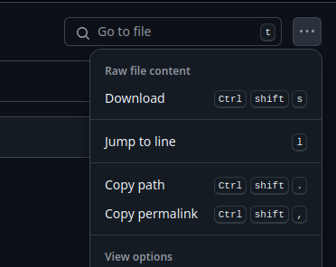

# Com veure els arxius des del navegador

Per veure la pàgina de GitHub des del navegador s'utilitzarà el següent enllaç: https://raw.githack.com/

## Tutorial

1. Anirem al `index.html` i copiarem el _permalink_.

4. Entrem a la pàgina 
