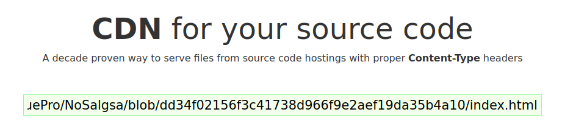

# Com veure els arxius des del navegador

Per veure la pàgina de GitHub des del navegador s'utilitzarà el següent enllaç: https://raw.githack.com/

## Tutorial

1. Anirem al `index.html` i copiarem el _permalink_.

2. Entrem a la pàgina anomenada anteriorment i enganxem l'enllaç

3. Copiarem el primer enllaç que surt a la part inferior

4. Enganxem l'enllaç al navegador i podrem observar la pàgina

> [!IMPORTANT]
> Cada vegada que el contingut es modifica, s'ha de crear un nou enllaç
