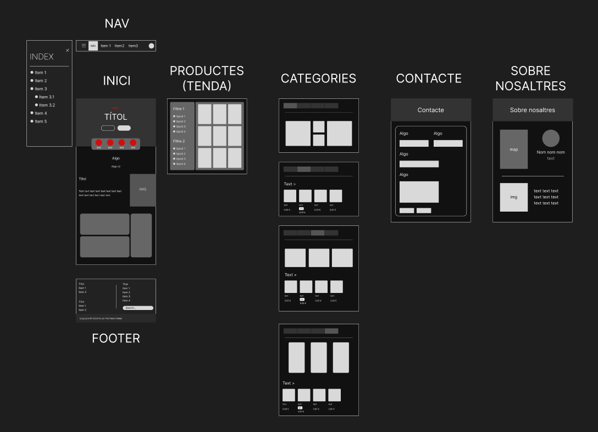
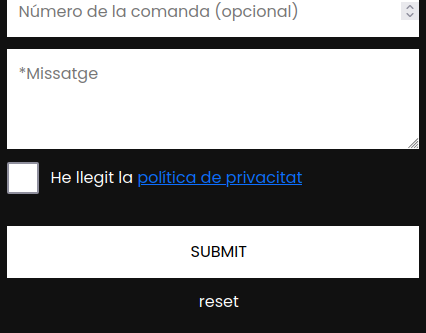
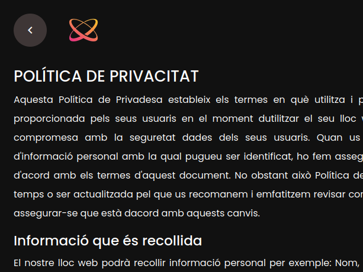

# Aspectes de la pàgina

## Per què he escollit aquesta pàgina web?

He escollit aquest tema perquè ja estic familiaritzat amb ell. 

## Prototip

Aquesta és la imatge del meu prototip al Figma:

## Justificació de les metadades

`<meta charset="utf-8" />` (`html:5`): Permet utilitzar la majoria de caràcters

`<meta name="viewport" content="width=device-width, initial-scale=1.0">` (`html:5`):

- `width`: Determina l'amplada de la pàgina web.
  - `device-width`: Aplica l'amplada del dispositiu.
- `initial-scale`: Controla el zoom. Per defecte és 1.

`<meta name="author" content="Pol Poblet Pallisé" />`: Especifica l'autor de la pàgina web

`<meta name="description" content="...">`: La descripció de la pàgina, o sigui, el text d'abaix el títol quan es busca pel navegador

## Justificació de la semàntica

S'ha utilitzat els següents _tags_:

- `nav`: Barra de navegació

- `aside`: Menú lateral

- `main`: Conté tot el contingut principal de la pàgina

- `header`: Imatge o portada principal de la pàgina

- `section`: Blocs de continguts

- `footer`: Peu de pàgina

- `article`: Blocs dels jocs

## Justificació de la LOPD i RGDP

S'ha afegit un botó, que si no és activat, no es pot enviar el formulari.

Quan li donem a l'enllaç, ens portarà a una pàgina on hi haurà la Política de Privacitat.

## Hosting

## Planificació del projecte

S'ha utilitzat el GitHub ja que el projecte el tinc en aquesta plataforma, i així està tot agrupat.

Es suposa que està a l'apartat **Projects**, però deixo l'<a href='https://github.com/users/akinfenwa69/projects/2/views/1'>enllaç</a>.
