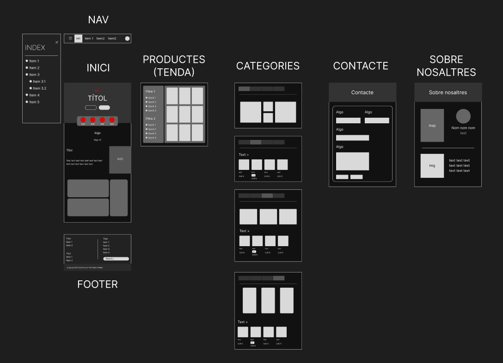

# Aspectes de la pàgina

## Per què he escollit aquesta pàgina web?

He escollit aquest tema perquè ja estic familiaritzat amb ell. 

## Prototip

Aquesta és la imatge del meu prototip al Figma:

## Justificació de les metadades

`<meta charset="utf-8" />` (html:5): Permet utilitzar la majoria de caràcters

`<meta name="viewport" content="width=device-width, initial-scale=1.0">` (html:5):

- `width`: Determina l'amplada de la pàgina web.
  - `device-width`: Aplica l'amplada del dispositiu.
- `initial-scale`: Controla el zoom. Per defecte és 1.

`<meta name="author" content="Pol Poblet Pallisé" />`: Especifica l'autor de la pàgina web

`<meta name="description" content="...">`: La descripció de la pàgina, o sigui, el text d'abaix el títol quan es busca pel navegador

## Justificació de la semàntica

## Justificació de la LOPD i RGDP

